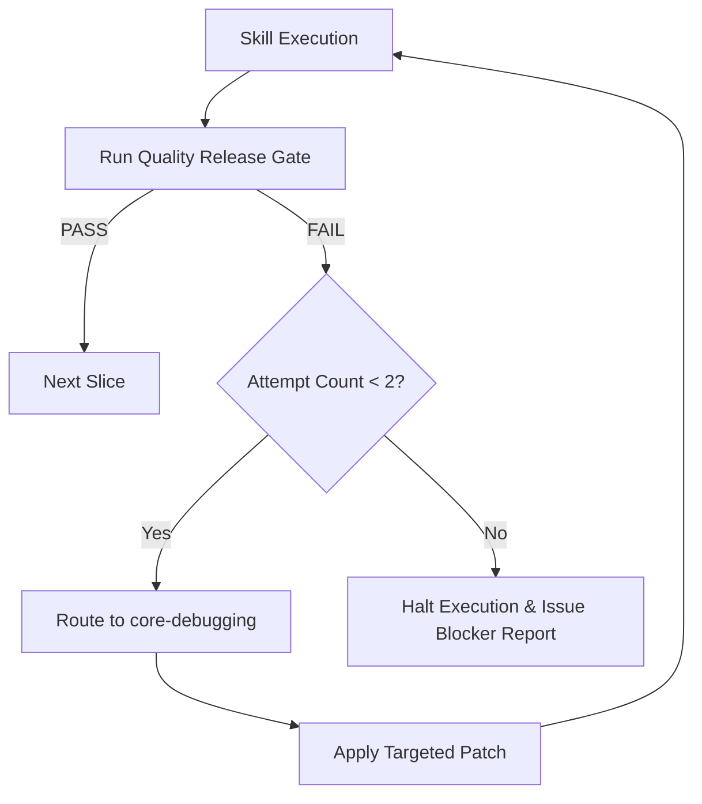

# Failure Recovery & Debugging Protocol

When a skill slice execution or quality gate check fails, `dev-orchestrator` follows a strict recovery protocol.

## Protocol Rules
1. **Gate Behavior**: `quality-release-gate` REPORTS failures and NEVER attempts fixes itself.
2. **Routing Path**: Failed step -> `dev-orchestrator` -> `core-debugging` -> Retry failed step.
3. **Cycle Cap**: Maximum **2 remediation cycles** per failing check.
4. **Escalation**: If a check still fails after 2 cycles, halt slice execution and issue a Blocker Report.

## Failure Cycle Execution Flow

## Blocker Report Requirements
When remediation fails twice, generate a Blocker Report containing:
- **Failing Check**: Exact test or lint command that failed.
- **Exit Code & Output**: Raw error log snippet and exit code.
- **Root Cause Hypothesis**: Analysis of why automated remediation failed.
- **Preserved State**: Confirmation that working tree modifications were safely preserved or stashed.
- **Human Action Required**: Clear prompt describing what manual intervention is needed to unblock.
